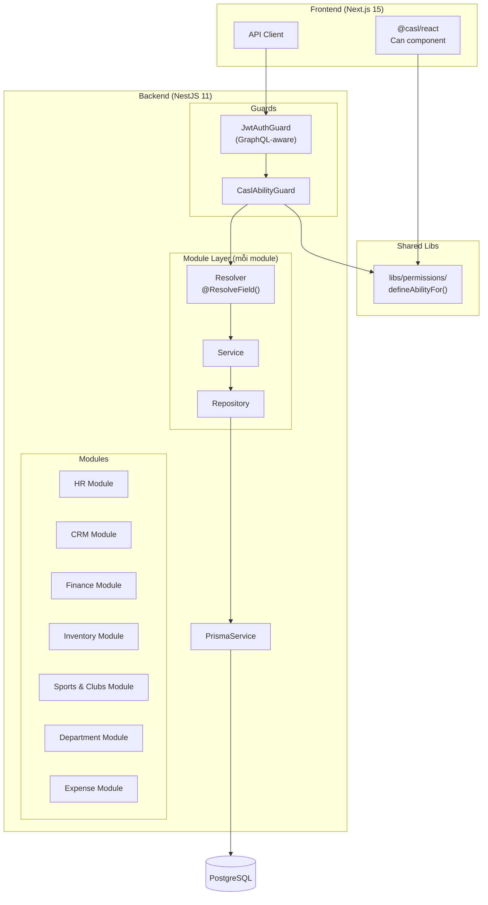
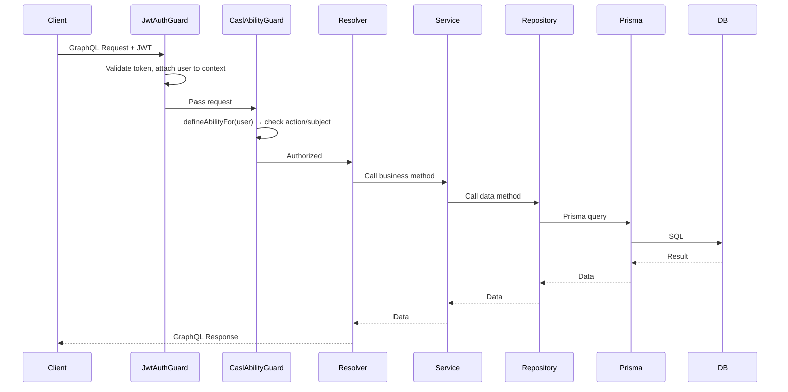

# Tài liệu Thiết kế — BE Schema Design

## Tổng quan

Tài liệu này mô tả thiết kế kỹ thuật cho việc nâng cấp toàn diện backend schema của hệ thống Enterprise ERP Dashboard. Phạm vi bao gồm: mở rộng GraphQL entity, tạo module mới (Sports & Clubs, Department), triển khai CRUD mutation, pagination, relationship resolution, tích hợp CASL cho auth/authz, và bổ sung Expense Management.

### Hiện trạng

- GraphQL entity chỉ expose 3-4 field thay vì toàn bộ Prisma model
- Chỉ có query list, không có findById, mutation, pagination
- Không có relationship resolution (chỉ trả về ID thay vì nested object)
- Auth guard dùng `RolesGuard` đơn giản, chưa tích hợp CASL
- `JwtAuthGuard` và `CurrentUser` chỉ hỗ trợ HTTP context, chưa hỗ trợ GraphQL
- Thiếu module Sports & Clubs và Department trên backend
- Chưa có Prisma model và GraphQL cho Expense Management

### Mục tiêu

- Backend schema phản ánh đầy đủ data model từ Prisma
- Hỗ trợ CRUD hoàn chỉnh cho tất cả module
- Pagination cho mọi query danh sách
- Relationship resolution qua `@ResolveField()`
- CASL-based authorization dùng chung giữa FE và BE
- Expense Management hoàn chỉnh

## Kiến trúc

### Kiến trúc tổng thể



### Luồng xử lý Request



### Quyết định kiến trúc

| Quyết định | Lý do |
|---|---|
| Dùng `@casl/ability` thay vì `RolesGuard` | CASL hỗ trợ fine-grained permission (action + subject + conditions), dùng chung FE/BE |
| Shared ability factory trong `libs/permissions/` | Đảm bảo logic phân quyền nhất quán, tránh duplicate |
| `@ResolveField()` cho relationship | Lazy loading, chỉ resolve khi client request nested field |
| Prisma `include` thay vì DataLoader | Đơn giản hơn cho giai đoạn đầu, có thể migrate sang DataLoader sau |
| Generic `PaginatedResponse` | Tái sử dụng cho tất cả module, giảm boilerplate |
| Tách Expense thành module riêng | Expense có logic riêng (filter theo club/department), không nên gộp vào Finance |


## Thành phần và Giao diện (Components and Interfaces)

### 1. Shared Pagination Types

```typescript
// apps/api/src/shared/graphql/pagination.types.ts

@InputType()
export class PaginationInput {
  @Field(() => Int, { defaultValue: 1 })
  page: number = 1;

  @Field(() => Int, { defaultValue: 20 })
  limit: number = 20;
}

// Generic factory function cho PaginatedResponse
export function Paginated<T>(classRef: Type<T>): Type<IPaginatedType<T>> {
  @ObjectType({ isAbstract: true })
  abstract class PaginatedType implements IPaginatedType<T> {
    @Field(() => [classRef])
    items: T[];

    @Field(() => Int)
    total: number;

    @Field(() => Int)
    page: number;

    @Field(() => Int)
    limit: number;

    @Field(() => Int)
    totalPages: number;
  }
  return PaginatedType as Type<IPaginatedType<T>>;
}
```

### 2. CASL Shared Ability Factory

```typescript
// libs/permissions/index.ts

import { AbilityBuilder, PureAbility, createMongoAbility } from '@casl/ability';

export type AppAction = 'read' | 'create' | 'update' | 'delete' | 'manage';
export type AppSubject =
  | 'Employee' | 'Department' | 'Customer' | 'Invoice'
  | 'InventoryItem' | 'Club' | 'ClubMember'
  | 'Expense' | 'ExpenseCategory' | 'all';

export type AppAbility = PureAbility<[AppAction, AppSubject]>;

export function defineAbilityFor(user: { roles: string[] }): AppAbility {
  const { can, build } = new AbilityBuilder<AppAbility>(createMongoAbility);

  if (user.roles.includes('admin')) {
    can('manage', 'all');
  } else if (user.roles.includes('manager')) {
    can(['read', 'create', 'update'], 'all' as AppSubject);
  } else {
    // staff
    can('read', 'all' as AppSubject);
  }

  return build();
}
```

### 3. CaslAbilityGuard

```typescript
// apps/api/src/shared/permissions/casl-ability.guard.ts

@Injectable()
export class CaslAbilityGuard implements CanActivate {
  constructor(private reflector: Reflector) {}

  canActivate(context: ExecutionContext): boolean {
    const requirement = this.reflector.get<CheckAbilityMeta>(
      CHECK_ABILITY_KEY, context.getHandler()
    );
    if (!requirement) return true;

    const gqlCtx = GqlExecutionContext.create(context);
    const user = gqlCtx.getContext().req.user;
    const ability = defineAbilityFor(user);

    return ability.can(requirement.action, requirement.subject);
  }
}
```

### 4. CheckAbility Decorator

```typescript
// apps/api/src/shared/permissions/check-ability.decorator.ts

export const CHECK_ABILITY_KEY = 'check_ability';

export interface CheckAbilityMeta {
  action: AppAction;
  subject: AppSubject;
}

export const CheckAbility = (meta: CheckAbilityMeta) =>
  SetMetadata(CHECK_ABILITY_KEY, meta);
```

### 5. GraphQL-aware JwtAuthGuard

```typescript
// apps/api/src/shared/auth/jwt-auth.guard.ts (cập nhật)

@Injectable()
export class JwtAuthGuard implements CanActivate {
  canActivate(context: ExecutionContext): boolean {
    const ctx = GqlExecutionContext.create(context);
    const request = ctx.getContext().req;
    // Validate JWT token, attach user to request
    // ...
    return true;
  }
}
```

### 6. GraphQL-aware CurrentUser Decorator

```typescript
// apps/api/src/shared/auth/current-user.decorator.ts (cập nhật)

export const CurrentUser = createParamDecorator(
  (_data: unknown, ctx: ExecutionContext) => {
    const gqlCtx = GqlExecutionContext.create(ctx);
    return gqlCtx.getContext().req.user ?? null;
  }
);
```

### 7. Module Structure Pattern (áp dụng cho mỗi module)

Mỗi module mới (Sports & Clubs, Department, Expense) tuân theo pattern:

```
modules/<name>/
├── <name>.module.ts          # NestJS Module
├── <name>.resolver.ts        # GraphQL Resolver + @ResolveField()
├── entities/
│   └── <entity>.entity.ts    # GraphQL ObjectType
├── dto/
│   ├── create-<entity>.input.ts   # @InputType() cho create
│   └── update-<entity>.input.ts   # @InputType() cho update
├── services/
│   └── <name>.service.ts     # Business logic
└── repositories/
    └── <name>.repository.ts  # Prisma queries
```

### 8. Resolver Pattern (ví dụ HR)

```typescript
@Resolver(() => EmployeeEntity)
@UseGuards(JwtAuthGuard, CaslAbilityGuard)
export class HrResolver {
  constructor(private readonly hrService: HrService) {}

  @Query(() => PaginatedEmployee, { name: 'employees' })
  @CheckAbility({ action: 'read', subject: 'Employee' })
  employees(@Args('pagination', { nullable: true }) pagination?: PaginationInput) {
    return this.hrService.getEmployees(pagination);
  }

  @Query(() => EmployeeEntity, { name: 'employee' })
  @CheckAbility({ action: 'read', subject: 'Employee' })
  employee(@Args('id') id: string) {
    return this.hrService.getEmployeeById(id);
  }

  @Mutation(() => EmployeeEntity)
  @CheckAbility({ action: 'create', subject: 'Employee' })
  createEmployee(@Args('input') input: CreateEmployeeInput) {
    return this.hrService.createEmployee(input);
  }

  @Mutation(() => EmployeeEntity)
  @CheckAbility({ action: 'update', subject: 'Employee' })
  updateEmployee(@Args('id') id: string, @Args('input') input: UpdateEmployeeInput) {
    return this.hrService.updateEmployee(id, input);
  }

  @Mutation(() => Boolean)
  @CheckAbility({ action: 'delete', subject: 'Employee' })
  deleteEmployee(@Args('id') id: string) {
    return this.hrService.deleteEmployee(id);
  }

  @ResolveField(() => DepartmentEntity, { nullable: true })
  department(@Parent() employee: Employee) {
    return this.hrService.getDepartmentForEmployee(employee.departmentId);
  }

  @ResolveField(() => EmployeeEntity, { nullable: true })
  manager(@Parent() employee: Employee) {
    if (!employee.managerId) return null;
    return this.hrService.getEmployeeById(employee.managerId);
  }

  @ResolveField(() => [EmployeeEntity])
  reports(@Parent() employee: Employee) {
    return this.hrService.getReportsByManagerId(employee.id);
  }
}
```

### 9. myAbilities Query

```typescript
// apps/api/src/shared/permissions/abilities.resolver.ts

@Resolver()
@UseGuards(JwtAuthGuard)
export class AbilitiesResolver {
  @Query(() => GraphQLJSON, { name: 'myAbilities' })
  myAbilities(@CurrentUser() user: any) {
    const ability = defineAbilityFor(user);
    return ability.rules;
  }
}
```


## Mô hình Dữ liệu (Data Models)

### Prisma Models bổ sung

Cần thêm vào `apps/api/prisma/schema.prisma`:

```prisma
// ============================================================
// EXPENSE MANAGEMENT
// ============================================================

enum ExpenseStatus {
  pending
  approved
  rejected
  reimbursed
}

model ExpenseCategory {
  id          String   @id @default(cuid())
  name        String   @unique
  description String?
  createdAt   DateTime @default(now())
  updatedAt   DateTime @updatedAt

  expenses Expense[]

  @@map("expense_categories")
}

model Expense {
  id           String        @id @default(cuid())
  title        String
  amount       Float
  description  String?
  date         DateTime
  status       ExpenseStatus @default(pending)
  categoryId   String
  createdById  String
  clubId       String?
  departmentId String?
  createdAt    DateTime      @default(now())
  updatedAt    DateTime      @updatedAt

  category    ExpenseCategory @relation(fields: [categoryId], references: [id])
  createdBy   User            @relation(fields: [createdById], references: [id])
  club        Club?           @relation(fields: [clubId], references: [id])
  department  Department?     @relation(fields: [departmentId], references: [id])

  @@map("expenses")
}
```

Cần cập nhật model `User`, `Club`, `Department` để thêm relation ngược:

```prisma
// Thêm vào model User:
expenses Expense[]

// Thêm vào model Club:
expenses Expense[]

// Thêm vào model Department:
expenses Expense[]
```

### GraphQL Entity Mapping

#### EmployeeEntity (mở rộng đầy đủ)

| Prisma Field | GraphQL Field | GraphQL Type | Nullable |
|---|---|---|---|
| id | id | ID | No |
| code | code | String | No |
| name | name | String | No |
| email | email | String | No |
| phone | phone | String | Yes |
| position | position | String | No |
| hireDate | hireDate | DateTime | No |
| status | status | EmployeeStatus (enum) | No |
| departmentId | departmentId | String | No |
| managerId | managerId | String | Yes |
| userId | userId | String | Yes |
| createdAt | createdAt | DateTime | No |
| updatedAt | updatedAt | DateTime | No |
| — | department | DepartmentEntity | Yes (ResolveField) |
| — | manager | EmployeeEntity | Yes (ResolveField) |
| — | reports | [EmployeeEntity] | No (ResolveField) |

#### CustomerEntity (mở rộng đầy đủ)

| Prisma Field | GraphQL Field | GraphQL Type | Nullable |
|---|---|---|---|
| id | id | ID | No |
| name | name | String | No |
| email | email | String | Yes |
| phone | phone | String | Yes |
| company | company | String | Yes |
| status | status | CustomerStatus (enum) | No |
| ownerId | ownerId | String | No |
| createdAt | createdAt | DateTime | No |
| updatedAt | updatedAt | DateTime | No |
| — | owner | UserEntity | No (ResolveField) |
| — | invoices | [InvoiceEntity] | No (ResolveField) |

#### InvoiceEntity (mở rộng đầy đủ)

| Prisma Field | GraphQL Field | GraphQL Type | Nullable |
|---|---|---|---|
| id | id | ID | No |
| code | code | String | No |
| amount | amount | Float | No |
| tax | tax | Float | No |
| total | total | Float | No |
| status | status | InvoiceStatus (enum) | No |
| dueDate | dueDate | DateTime | Yes |
| issuedAt | issuedAt | DateTime | Yes |
| customerId | customerId | String | Yes |
| createdAt | createdAt | DateTime | No |
| updatedAt | updatedAt | DateTime | No |
| — | customer | CustomerEntity | Yes (ResolveField) |

#### InventoryItemEntity (mở rộng đầy đủ)

| Prisma Field | GraphQL Field | GraphQL Type | Nullable |
|---|---|---|---|
| id | id | ID | No |
| sku | sku | String | No |
| name | name | String | No |
| category | category | String | Yes |
| stock | stock | Int | No |
| minStock | minStock | Int | No |
| unit | unit | String | No |
| price | price | Float | No |
| status | status | InventoryItemStatus (enum) | No |
| createdAt | createdAt | DateTime | No |
| updatedAt | updatedAt | DateTime | No |

#### ClubEntity (mới)

| Prisma Field | GraphQL Field | GraphQL Type | Nullable |
|---|---|---|---|
| id | id | ID | No |
| name | name | String | No |
| sport | sport | String | No |
| description | description | String | Yes |
| status | status | ClubStatus (enum) | No |
| foundedAt | foundedAt | DateTime | Yes |
| createdAt | createdAt | DateTime | No |
| updatedAt | updatedAt | DateTime | No |
| — | members | [ClubMemberEntity] | No (ResolveField) |
| — | expenses | [ExpenseEntity] | No (ResolveField) |

#### ClubMemberEntity (mới)

| Prisma Field | GraphQL Field | GraphQL Type | Nullable |
|---|---|---|---|
| clubId | clubId | String | No |
| userId | userId | String | No |
| role | role | ClubMemberRole (enum) | No |
| joinedAt | joinedAt | DateTime | No |
| — | user | UserEntity | No (ResolveField) |
| — | club | ClubEntity | No (ResolveField) |

#### DepartmentEntity (mới)

| Prisma Field | GraphQL Field | GraphQL Type | Nullable |
|---|---|---|---|
| id | id | ID | No |
| name | name | String | No |
| parentId | parentId | String | Yes |
| — | parent | DepartmentEntity | Yes (ResolveField) |
| — | children | [DepartmentEntity] | No (ResolveField) |
| — | employees | [EmployeeEntity] | No (ResolveField) |

#### ExpenseCategoryEntity (mới)

| Prisma Field | GraphQL Field | GraphQL Type | Nullable |
|---|---|---|---|
| id | id | ID | No |
| name | name | String | No |
| description | description | String | Yes |
| createdAt | createdAt | DateTime | No |
| updatedAt | updatedAt | DateTime | No |

#### ExpenseEntity (mới)

| Prisma Field | GraphQL Field | GraphQL Type | Nullable |
|---|---|---|---|
| id | id | ID | No |
| title | title | String | No |
| amount | amount | Float | No |
| description | description | String | Yes |
| date | date | DateTime | No |
| status | status | ExpenseStatus (enum) | No |
| categoryId | categoryId | String | No |
| createdById | createdById | String | No |
| clubId | clubId | String | Yes |
| departmentId | departmentId | String | Yes |
| createdAt | createdAt | DateTime | No |
| updatedAt | updatedAt | DateTime | No |
| — | category | ExpenseCategoryEntity | No (ResolveField) |
| — | createdBy | UserEntity | No (ResolveField) |
| — | club | ClubEntity | Yes (ResolveField) |
| — | department | DepartmentEntity | Yes (ResolveField) |

### Enum Registration

Tất cả enum cần được đăng ký với GraphQL qua `registerEnumType`:

```typescript
import { registerEnumType } from '@nestjs/graphql';

// Trong file entity hoặc file enum riêng
registerEnumType(EmployeeStatus, { name: 'EmployeeStatus' });
registerEnumType(CustomerStatus, { name: 'CustomerStatus' });
registerEnumType(InvoiceStatus, { name: 'InvoiceStatus' });
registerEnumType(InventoryItemStatus, { name: 'InventoryItemStatus' });
registerEnumType(ClubStatus, { name: 'ClubStatus' });
registerEnumType(ClubMemberRole, { name: 'ClubMemberRole' });
registerEnumType(ExpenseStatus, { name: 'ExpenseStatus' });
```

### Input DTO Pattern

Mỗi mutation có Input DTO riêng. Ví dụ:

```typescript
@InputType()
export class CreateEmployeeInput {
  @Field() code: string;
  @Field() name: string;
  @Field() email: string;
  @Field({ nullable: true }) phone?: string;
  @Field() position: string;
  @Field() hireDate: Date;
  @Field(() => EmployeeStatus, { defaultValue: EmployeeStatus.active })
  status: EmployeeStatus;
  @Field() departmentId: string;
  @Field({ nullable: true }) managerId?: string;
  @Field({ nullable: true }) userId?: string;
}

@InputType()
export class UpdateEmployeeInput {
  @Field({ nullable: true }) name?: string;
  @Field({ nullable: true }) email?: string;
  @Field({ nullable: true }) phone?: string;
  @Field({ nullable: true }) position?: string;
  @Field({ nullable: true }) hireDate?: Date;
  @Field(() => EmployeeStatus, { nullable: true }) status?: EmployeeStatus;
  @Field({ nullable: true }) departmentId?: string;
  @Field({ nullable: true }) managerId?: string;
}
```

### Expense Filter Input

```typescript
@InputType()
export class ExpenseFilterInput {
  @Field({ nullable: true }) clubId?: string;
  @Field({ nullable: true }) departmentId?: string;
  @Field({ nullable: true }) categoryId?: string;
  @Field(() => ExpenseStatus, { nullable: true }) status?: ExpenseStatus;
}
```


## Correctness Properties

*Một property là một đặc tính hoặc hành vi phải luôn đúng trong mọi lần thực thi hợp lệ của hệ thống — về bản chất, đó là một phát biểu hình thức về những gì hệ thống phải làm. Properties đóng vai trò cầu nối giữa đặc tả dễ đọc cho con người và đảm bảo tính đúng đắn có thể kiểm chứng bằng máy.*

### Property 1: Entity field completeness

*For any* entity type (Employee, Customer, Invoice, InventoryItem, Club, ClubMember, Department, Expense, ExpenseCategory), the GraphQL entity class should declare a `@Field()` for every column defined in the corresponding Prisma model, with matching nullability (optional Prisma fields map to `{ nullable: true }` in GraphQL).

**Validates: Requirements 1.1, 1.2, 1.3, 1.4, 1.6, 2.2, 2.3, 3.1, 10.6**

### Property 2: CRUD round-trip

*For any* valid entity input data and any module (HR, CRM, Finance, Inventory, Sports & Clubs, Department, Expense, ExpenseCategory), creating a record via the create mutation and then querying it by the returned ID should produce a record with matching field values.

**Validates: Requirements 3.4, 4.1, 4.2, 4.3, 4.4, 4.5, 10.9**

### Property 3: FindById returns correct record

*For any* entity that exists in the database, calling the findById query with that entity's ID should return a record whose fields match the original entity.

**Validates: Requirements 2.6, 3.3, 5.1, 5.2, 5.3, 5.4**

### Property 4: FindById and Delete with non-existent ID throws NotFoundException

*For any* randomly generated ID that does not exist in the database, calling findById or delete on any module should throw a `NotFoundException`.

**Validates: Requirements 4.7, 5.5**

### Property 5: Pagination metadata consistency

*For any* list query with valid pagination parameters (page ≥ 1, 1 ≤ limit ≤ 100), the response should satisfy: `totalPages == ceil(total / limit)`, `page == requested page`, `items.length <= limit`, and `items.length == min(limit, total - (page-1)*limit)` when page is within range. Additionally, for any limit > 100, the effective limit should be capped at 100.

**Validates: Requirements 6.2, 6.4, 6.5**

### Property 6: Relationship resolution correctness

*For any* entity with a foreign key relationship (Employee→Department, Employee→Manager, Customer→Owner, Customer→Invoices, Invoice→Customer, Club→Members, Department→Parent/Children, Expense→Category/CreatedBy/Club/Department, Club→Expenses), resolving the relationship field should return the entity (or list of entities) whose primary key matches the foreign key value. Nullable foreign keys should resolve to null when the FK is null.

**Validates: Requirements 7.1, 7.2, 7.3, 7.4, 7.5, 7.6, 7.7, 7.8, 10.10, 10.11**

### Property 7: CASL role-based ability

*For any* action in {read, create, update, delete, manage} and any subject in {Employee, Department, Customer, Invoice, InventoryItem, Club, ClubMember, Expense, ExpenseCategory}, the `defineAbilityFor` function should satisfy:
- Admin users: `ability.can(action, subject)` returns `true` for all actions and subjects
- Manager users: `ability.can(action, subject)` returns `true` for read/create/update, and `false` for delete
- Staff users: `ability.can('read', subject)` returns `true`, and `ability.can(action, subject)` returns `false` for create/update/delete

**Validates: Requirements 8.4, 8.5, 8.6**

### Property 8: myAbilities query round-trip

*For any* authenticated user with a known role, the `myAbilities` query should return CASL rules that, when used to construct an Ability instance, produce the same permission results as calling `defineAbilityFor(user)` directly.

**Validates: Requirements 9.3**

### Property 9: Expense filtering correctness

*For any* set of expenses in the database and any combination of filter parameters (clubId, departmentId, categoryId, status), the `expenses` query should return only expenses that match ALL specified filter criteria. When `clubId` filter is null/unset, expenses with any clubId (including null) should be returned. When filtering by a specific `clubId`, only expenses belonging to that club should be returned.

**Validates: Requirements 10.4, 10.5, 10.7**


## Xử lý Lỗi (Error Handling)

### Chiến lược xử lý lỗi

| Loại lỗi | Xử lý | HTTP/GraphQL Code |
|---|---|---|
| Record không tồn tại (findById, update, delete) | Throw `NotFoundException` với message mô tả entity + id | GraphQL error with `NOT_FOUND` extension |
| Vi phạm unique constraint (create, update) | Catch Prisma `P2002` error, throw `ConflictException` với field bị trùng | GraphQL error with `CONFLICT` extension |
| Validation lỗi (input không hợp lệ) | NestJS validation pipe tự động reject | GraphQL error with `BAD_USER_INPUT` extension |
| Unauthorized (không có JWT) | `JwtAuthGuard` throw `UnauthorizedException` | GraphQL error with `UNAUTHENTICATED` extension |
| Forbidden (không đủ quyền CASL) | `CaslAbilityGuard` throw `ForbiddenException` | GraphQL error with `FORBIDDEN` extension |
| Database connection error | Prisma throw, NestJS exception filter catch | GraphQL error with `INTERNAL_SERVER_ERROR` extension |

### Error Handling Pattern trong Service

```typescript
// Ví dụ trong HrService
async getEmployeeById(id: string): Promise<Employee> {
  const employee = await this.hrRepository.findById(id);
  if (!employee) {
    throw new NotFoundException(`Employee with id "${id}" not found`);
  }
  return employee;
}

async createEmployee(input: CreateEmployeeInput): Promise<Employee> {
  try {
    return await this.hrRepository.create(input);
  } catch (error) {
    if (error instanceof Prisma.PrismaClientKnownRequestError && error.code === 'P2002') {
      const field = (error.meta?.target as string[])?.join(', ');
      throw new ConflictException(`Employee with duplicate ${field} already exists`);
    }
    throw error;
  }
}
```

### Pagination Edge Cases

- `page < 1` → clamp to 1
- `limit < 1` → clamp to 1
- `limit > 100` → clamp to 100
- `page` vượt quá tổng số trang → trả về `items: []` với metadata chính xác

## Chiến lược Kiểm thử (Testing Strategy)

### Phương pháp kiểm thử kép

Dự án sử dụng kết hợp unit test và property-based test:

- **Unit tests**: Kiểm tra các ví dụ cụ thể, edge case, và error condition
- **Property-based tests**: Kiểm tra các thuộc tính phổ quát trên nhiều input ngẫu nhiên

Cả hai đều cần thiết và bổ sung cho nhau.

### Thư viện Property-Based Testing

- **Library**: `fast-check` (cho TypeScript/JavaScript)
- **Cấu hình**: Mỗi property test chạy tối thiểu 100 iterations
- **Tag format**: `Feature: be-schema-design, Property {number}: {property_text}`

### Unit Tests

Tập trung vào:
- Ví dụ cụ thể cho mỗi CRUD operation (tạo employee với data cụ thể, verify kết quả)
- Edge case: empty string input, null values, boundary values
- Error conditions: NotFoundException, ConflictException, ForbiddenException
- Integration test: GraphQL resolver end-to-end với test database

### Property-Based Tests

Mỗi correctness property ở trên sẽ được implement bằng MỘT property-based test duy nhất:

1. **Property 1 (Entity field completeness)**: Generate random Prisma model data → verify GraphQL entity has all fields
   - Tag: `Feature: be-schema-design, Property 1: Entity field completeness`

2. **Property 2 (CRUD round-trip)**: Generate random valid input → create → findById → compare
   - Tag: `Feature: be-schema-design, Property 2: CRUD round-trip`

3. **Property 3 (FindById returns correct record)**: Seed random records → findById → verify match
   - Tag: `Feature: be-schema-design, Property 3: FindById returns correct record`

4. **Property 4 (NotFoundException)**: Generate random non-existent IDs → call findById/delete → expect NotFoundException
   - Tag: `Feature: be-schema-design, Property 4: FindById and Delete with non-existent ID throws NotFoundException`

5. **Property 5 (Pagination metadata)**: Generate random datasets + pagination params → verify metadata consistency
   - Tag: `Feature: be-schema-design, Property 5: Pagination metadata consistency`

6. **Property 6 (Relationship resolution)**: Seed related records → resolve field → verify FK match
   - Tag: `Feature: be-schema-design, Property 6: Relationship resolution correctness`

7. **Property 7 (CASL role-based ability)**: Generate random action/subject combinations × 3 roles → verify ability
   - Tag: `Feature: be-schema-design, Property 7: CASL role-based ability`

8. **Property 8 (myAbilities round-trip)**: Generate random user roles → call myAbilities → reconstruct ability → compare
   - Tag: `Feature: be-schema-design, Property 8: myAbilities query round-trip`

9. **Property 9 (Expense filtering)**: Seed random expenses with various clubId/departmentId/categoryId/status → apply filters → verify all results match
   - Tag: `Feature: be-schema-design, Property 9: Expense filtering correctness`

### Cấu trúc Test Files

```
apps/api/src/
├── modules/
│   ├── hr/
│   │   ├── __tests__/
│   │   │   ├── hr.service.spec.ts          # Unit tests
│   │   │   └── hr.service.property.spec.ts # Property tests
│   │   ...
│   ├── expense/
│   │   ├── __tests__/
│   │   │   ├── expense.service.spec.ts
│   │   │   └── expense.service.property.spec.ts
│   │   ...
├── shared/
│   ├── permissions/
│   │   ├── __tests__/
│   │   │   ├── casl-ability.spec.ts
│   │   │   └── casl-ability.property.spec.ts
│   ├── graphql/
│   │   ├── __tests__/
│   │   │   └── pagination.property.spec.ts
```

